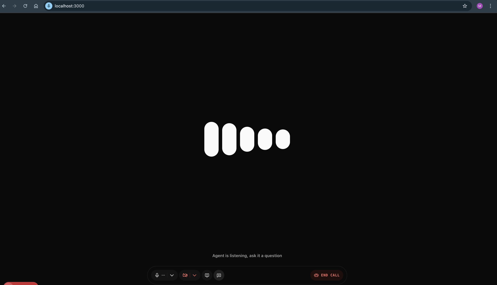

# RecruitFlow-Frontend

🎥 **RecruitFlow-Frontend** is the frontend interface for **RecruitFlow-Interviews**, a live AI-powered interview simulation platform that connects candidates with an intelligent virtual interviewer using WebRTC and large language models in real time.

This frontend allows users to upload resumes, select job roles, participate in live interviews, and download a detailed PDF report afterward.

---

## 🌐 Live Interview Simulation Flow

1️⃣ JD Parser & Flow Generator
↓
2️⃣ Interview Agent (GPT-4o Realtime)
↓
3️⃣ Report Agent (Transcript & PDF Generator)
↓
🧑‍💻 Candidate UI (This Repo - Next.js)

---

- Both the **Interview Agent** and **Candidate UI** connect to **LiveKit Cloud** via WebRTC.
- The **JD Parser** prepares a dynamic interview flow.
- The **Interview Agent** uses GPT-4o (streaming) to conduct the interview.
- After the interview, the **Report Agent** processes the transcript and sends a PDF report back to the frontend.

---

## 🧠 Key Features

- 📎 Resume Upload for personalized interviews  
- 📝 Job Title & Description input for custom question paths  
- 📡 Live WebRTC audio/video session with an AI interviewer  
- 🔁 Real-time interaction via GPT-4o streaming  
- 📄 Post-interview PDF report generation and download  
- 🎨 Clean, responsive UI built with TailwindCSS  

---

## ⚙️ Tech Stack

- **Next.js (React App Router)**
- **TypeScript**
- **TailwindCSS**
- **LiveKit React SDK**
- **Axios** for backend API communication
- **LiveKit Cloud** for WebRTC signaling and media routing

---
## 🔌 WebRTC Flow

- Frontend uses LiveKit API to **create and join a room**.
- Room credentials are securely passed to the backend.
- Backend AI agent joins the room as a peer.
- Audio/Video is streamed via LiveKit between the candidate and the AI.
- All conversation is logged and post-processed for reports.

---

## Connect To the Agent
> **Important:**  
> You must run the backend agents from the [RecruitFlow-Agents](https://github.com/Muco0l/RecuritFlow_Interview_Agents.git)repository before using this frontend.

